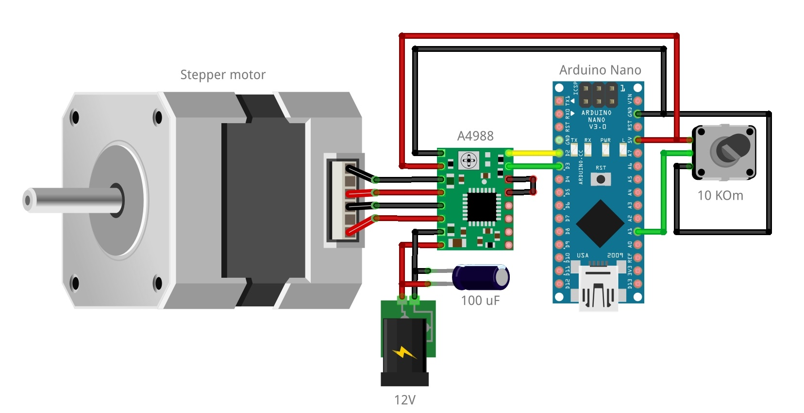

# arduino-welding-robot
[ArduinoC] Robot for welding of rotating pipes.

## Getting started
1. Cloning this repository
2. Build **sketch/sketch.ino** in [Arduino IDE](https://github.com/arduino/arduino-ide/)

## Schematic

  
   
  Electrical schematic

## Pictures

  
  
   
  Device image and work image

